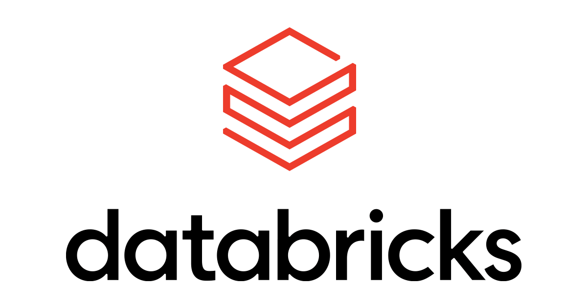

Welcome to my GitHub!

# 👋 Hi there! I'm Yogesh Sivakumar (📍**Ireland**) 

A Software and Data Ops professional who believes every dataset has a story. I treat every dataset as a pipeline waiting to be optimized, from ingestion to transformation to consumption.

I design application workflows that don’t just move data, but refine, structure, and elevate it into decision-ready assets.

**Fun Fact:**
  "" I use CTEs so often that I naturally think in WITH clauses :)
breaking problems into logical steps, chaining them together, and only materializing results when it truly matters. ""

## My Technical Toolkit

  
  
  
  
  
  
  
  
  
  
  
  
  
  
  
  
  
  
  
  
  
  
  
  
  
  
  
  
  

### DataCamp [(Profile-Link)](https://www.datacamp.com/portfolio/24150029)
- **75,300+ XP** earned  
- Ranked **Silver** in my class leaderboard  
- Completed **15+ Certifications**  
- Finished **10+ Hands-on Projects**
### Microsoft Badges
- **24 Badges** [ADF, Azure SQL DB, Fabric, and more...]
- Currently Focusing on Microsoft Fabric
### HackerRank
- 3⭐ Java
- 4⭐ SQL  
- 3⭐ Python  
- Earned **15,000+ Hackos** 

### Contact Me

Currently querying the job market...  
If you're hiring for Software/data engineer roles, let's run a full join! 

- [**LinkedIn**](https://www.linkedin.com/in/yogesh-s123/)
- [**yogeshsivakumar18@yahoo.com**](mailto:yogeshsivakumar18@yahoo.com)

## What You'll Find Here

My GitHub is a collection of projects and research that reflect my passion for data, analytics, and real-world problem solving. Here's a quick breakdown:

- **Application Development Projects**
- **Data Engineering**
- **Machine Learning Projects**  
- **Big Data Analytics**  
- **Statistical Research & Reports**  
- **Dashboards & Visualizations**  

Each repo includes a detailed README with the problem statement, tools used, results, and (sometimes) fun facts about the journey.
